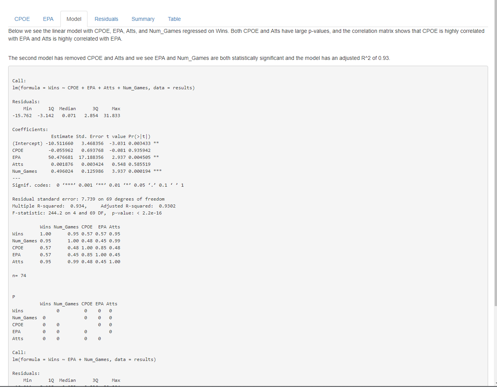
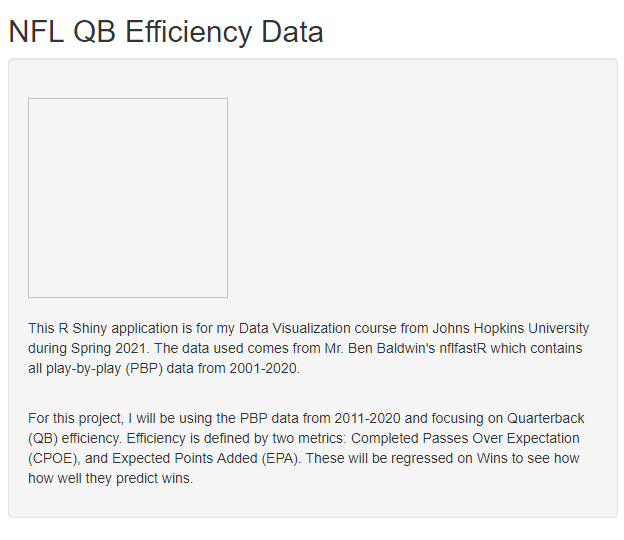
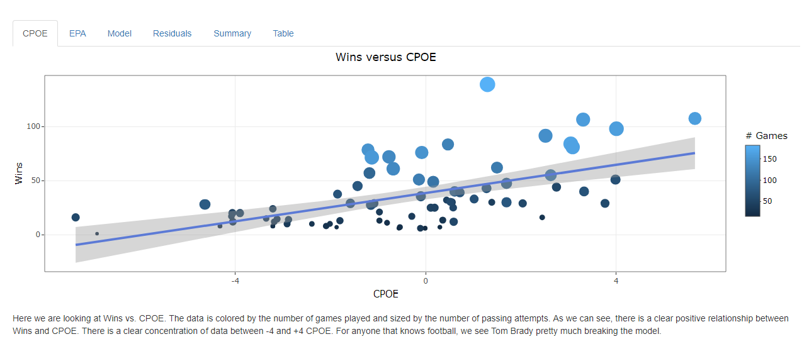
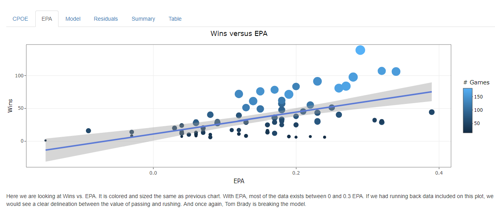
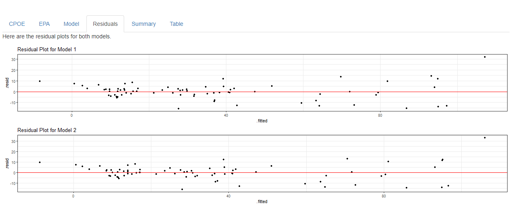
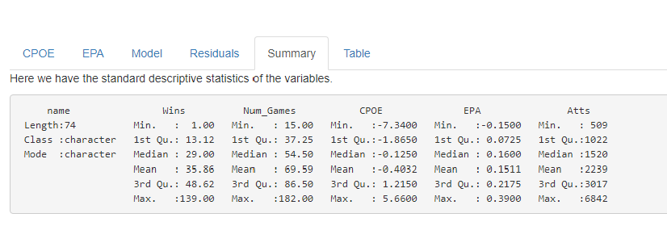
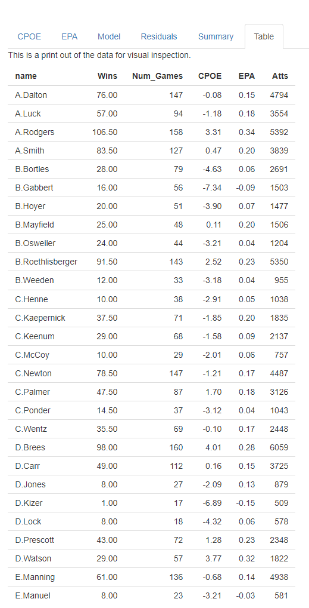

```{r setup, include=FALSE, message = FALSE}
knitr::opts_chunk$set(echo = TRUE, fig.width = 8, fig.height = 4)

library(ggplot2)
library(tidyverse)
library(nflfastR)
library(gridExtra)
library(olsrr)
library(skimr)
library(ggrepel)
library(ggimage)
library(dplyr)
library(knitr)
library(purrr)
library(qs)
library(httr)
library(readr)
library(reshape2)

```

```{r, echo=FALSE, cache=TRUE, message = FALSE}
pbp <- load_pbp(2011:2020)
```

```{r, echo = FALSE, message = FALSE}
qb_wins <- pbp %>%
  mutate(
    wins = case_when(
      result == 0 ~ 0.5,
      result > 0 & posteam == home_team ~ 1,
      result < 0 & posteam == away_team ~ 1,
      TRUE ~ 0
    )
  ) %>%
  filter(!is.na(cpoe)) %>%
  group_by(name, game_id) %>%
  summarise(wins = first(wins)) %>%
  summarise(Wins = sum(wins),
            Num_Games = n())

qb_eff <- pbp %>%
  filter(!is.na(cpoe) & !is.na(epa)) %>%
  group_by(name) %>%
  summarise(CPOE = round(mean(cpoe), 2),
            EPA = round(mean(epa), 2),
            Atts = n()) %>%
  ungroup()

results <- bind_cols(qb_wins, qb_eff[2:4]) %>%
  filter(Atts > 500)
```

# Abstract

National Football League (NFL) teams traditional methods of player evaluation is outdated, especially at the quarterback position, which leads to teams overpaying for sub-par talent. Traditional methods include completion percentage, total passing yards, total passing touchdowns, and others. The objective of this project is to shed light on better ways for teams to evaluate quarterback play.

I will create an R Shiny application to show the correlations between modern metrics, completion percentage over expectation and expected points added, and wins. I will utilize multivariate linear regression to show which metric, or both, correlate and predict with more accuracy.

My results show that the metrics correlate highly with each other, so completion percentage over expectation was dropped from the model, and expected points added was shown to be statistically significant to Wins with an R$^2$ of 0.932.

In conclusion, the more modern metric of expected points added correlates well with Wins and is an accurate predictor.

# Introduction

In American football, the Quarterback (QB) is king. In all of professional sports, it is the single most important position bar none. No other position in a team sport is as responsible for the success and failure of their team as the QB is. Because of this fact, a lot of research has started up over the past decade into this broad topic. Therefore, the focus of my project is to look at just how important the QB is to a team's success and create an R Shiny application to display that.

# Background

## Previous Work

For my project \#2, I did some basic visualizations using a subset of the data set I am using for this project. In particular, I looked at how Expected Points Added (EPA) compares to Completion Percentage Over Expected (CPOE). To better understand these, we need some definitions. The two following definitions come from Advanced Football Analytics:

> **Expected Points (EP)** -- The value of the current down, distance, and field position situation in terms of future expected net point advantage. In other words, it is the net point value a team can expect given a particular combination of down, distance, and field position. First and goal at the one represents an EP near 6, while 3rd and 20 at a team's own one yard line represents an EP of about -2. EP differs from Win Probability (WP) in that it does not take into account the game score and time remaining.[@afa]

> **Expected Points Added (EPA)** -- The difference between the Expected Points (EP) at the start of a play and the EP at the end of the play. EPA is the measure of a play's impact on the score of the game. An individual player's EPA is the sum of the EPA of the plays in which that player was directly involved. Being directly involved is defined as an offensive player who ran, threw, or kicked the ball, was targeted by a pass, or flagged for a penalty.[@afa]

For CPOE, Josh Hermsmeyer said this:

> Completion percentage is the performance measurable that best translates from college to the NFL. The metric's shortcomings --- players can pad their completion percentage with short, safe passes, for instance --- are well-known. But even in its raw form, it's a useful predictive tool.

> Its kissing cousin in the pantheon of stats that translate from college to the pros is average depth of target: Passers who throw short (or deep) in college tend to continue that pattern in the NFL. These two metrics can be combined to create an expected completion percentage, which helps correct the deficiencies in raw completion percentage. If you give more credit to players who routinely complete deeper passes --- and dock passers who dump off and check down more frequently --- you can get a clearer picture of a player's true accuracy and decision-making.

> Another important adjustment is to account for the level of competition a player faced. ESPN's Total Quarterback Rating does this, and we're doing it, too. For instance, passes in the Big Ten are completed at a lower rate than in the Big 12 and the Pac-12. We should boost players from conferences where it is tougher to complete a pass and ding players whose numbers are generated in conferences where passing is easier.

> When we make these adjustments, and then subtract expected completion percentage from a QB's actual completion percentage, we get a new metric: completion percentage over expected, or CPOE. An example: In 2011 at Wisconsin, Russell Wilson had a raw completion percentage of 73 percent. We would expect an average QB in the same conference who attempted the same number of passes at the same depths that Wilson attempted to have a completion percentage of just 57 percent. So Wilson posted an incredible CPOE of +16 percentage points in his last year of college. CPOE translates slightly less to the NFL than either raw completion percentage or average depth of target, but it does a substantially better job of predicting on-field production. In stat nerd parlance, we've traded a little stability for increased relevance.[@hermsmeyer2019]

Basically, CPOE is a measure of a QB's completion percentage compared to all other QB's in similar situations with strength of opponent taken into account. Josh Hermsmeyer's premise from that article is that NFL teams are looking at the wrong things when projecting a college QB's game to the next level. CPOE is less stable but overall more relevant because it is better at predicting on-field production.

Another leader in looking at QB efficiency is the company ProFootballFocus (PFF). In 2020, they posted an article looking at how a combination of their internal grades and EPA, combined with Bayesian Inference, helps them predict future production and rank the active QB's. In their research, they found, that for second-year QB's, the effect size in their model is up to 0.025 EPA per play (the difference between the seventh- and 13th-best passing offense in 2019).[@pffB] This helps illustrate that the higher a QB's EPA per play is, in general the more efficient they are.

## Data

For my project, I will be using the data set created by Mr. Ben Baldwin called 'nflfastR' (www.nflfastr.com). It is a database containing NFL play-by-play data back to 1999. It includes the advanced metrics I discussed previously in EPA and CPOE. The data set contains 361 variables and, depending on how many seasons you're are looking at, hundreds of thousands of observations. For this project, I will be using data from the years 2011-2020 (well over 400,000 observations). Of the 361 variables, I will be using a very small subset, only 6 of the variables (one of which, 'Wins', will be a mutation of the 'result' variable).

# Approach

## Extract, Transfer & Load

First, I needed to get the data into a usuable format. Once the 'nflfastR' package is loaded up, you can pull the data from it by X years (either single or multiple). From there, I had to distill it down into Name, EPA, CPOE, Attempts, Wins, and Number of Games played. I utilized the Tidyverse package to accomplish this: first by determining the number of wins each QB accumulated. There is a variable called 'result' that gives the difference in score between the home team and the away team from the home team's perspective. So a positive result is a win, a negative result is a loss, and a zero is a tie. The issue is that every observation is an individual play and each observation contains the same result value for a game. With some help from Mr. Ben Baldwin himself on his Discord server, I was able to get the number of wins by QB (a tie is counted as half a win).

With the wins calculated, it was a simple matter to calculate the CPOE and EPA of each QB. The two data frames were then combined and filtered for a minimum of 500 attempts to keep out backup QBs who might have much higher variance due to their low sample size. A print out of this code will be available in the Appendix.

## Exploratory Data Analysis

Next is my EDA. Below is an overview of the final data set I used.

```{r, echo=FALSE}
mydata <- skim_without_charts(results)

head(mydata)
```

So I am working with 6 variables and 74 observations, or QB's, that played between 2011 and 2020 and had at least 500 passing attempts. I know the data isn't normally distributed, but given this is just a cursory look at the relationships, I did not go in depth into investigating the distributions and if any transforms needed to happen.

## R Shiny

With my data loaded and ready to use, I got to creating my application.

I didn't want the user to be able to change the axis variables, so I refrained from including any sort of input from the user. Instead I have six tabs: CPOE, EPA, Model, Residuals, Summary, and Table and a brief overview of what the application entails. Each tab is as follows:

-   CPOE - This tab contains the plot of Wins vs. CPOE

-   EPA - This tab contains the plot of Wins vs. EPA

-   Model - This tab contains the printouts relevant to the models, including a correlation matrix

-   Residuals - This tab contains the residual plots for both models

-   Summary - This tab contains the descriptive statistics for the data

-   Table - This tab contains a printout of the data frame

The description of the app on the left side is done in the sidebarPanel() using fluidrow() to handle the text. The image for the website nflfastR is included for flair. Each tab is created in the mainPanel() using tabPanel() and the text is output using p().

Both the CPOE and EPA tabs use plotly() with ggplot to create the tooltip that appears when the user hovers over the data points. The Model, Summary, and Table tabs uses renderPrint() and the Residuals tab uses renderPlot() since they are not interactive.

# Results

## Model

For the exploration of QB efficiency, I found there to be high correlation between CPOE and EPA and Attempts and Number of Games. I was not surprised by the latter, but I was a little surprised by the former. Neither metric is used in the calculation of the other, and CPOE is solely a measure of completion whereas EPA is a measure of everything the QB does, not just passing. With removing CPOE and Attempts, the R$^2$ improves slightly from 0.93 to 0.932, but all features are now statistically significant (see Figure 1 below).

```{r, echo = FALSE, fig.cap = "Model Tab", fig.align = 'center', out.width = "75%", out.height="75%"}

```

\newpage

## R Shiny

The application overall came together quite nicely. My application properly displays multiple plots comparing the correlation of CPOE and EPA to Wins, builds a simple linear model to show the correlations, plots the residuals, and then prints out the descriptive statistics and the data frame itself. As seen below in Figures 02 - 07:

```{r, echo = FALSE, fig.cap = "Introduction", fig.align = 'center', out.width = "75%", out.height="75%"}

```

```{r, echo = FALSE, fig.cap = "Wins vs. CPOE", fig.align = 'center', out.width = "75%", out.height="75%"}

```

```{r, echo = FALSE, fig.cap = "Wins vs. EPA", fig.align = 'center', out.width = "75%", out.height="75%"}

```

```{r, echo = FALSE, fig.cap = "Residual Plots", fig.align = 'center', out.width = "75%", out.height="75%"}

```

```{r, echo = FALSE, fig.cap = "Summary Statistics", fig.align = 'center', out.width = "75%", out.height="75%"}

```

```{r, echo = FALSE, fig.cap = "Table", fig.align='center', fig.align = 'center', out.width = "75%", out.height="75%"}

```

\newpage

## Issues / Future Work

The primary issue I ran up against was getting the tooltip function to work with selectable data. As the charts currently stand, when you move the cursor over a data point on the CPOE and EPA plots, a tooltip pops up that displays the 'X' and 'Y' data, plus some additional data made possible by plotly. I wanted this functionality along with allowing the user to select the data to display on the 'X' and 'Y' axes, but I couldn't get that to work. I chose to go with the working tooltip since I was able to get the changeable axes to work in Project \#2.

My secondary issue is data storage. As of right now, the application has to pull the PBP data every time I run the application. I'd like to find a way to store that data somewhere so it will not have to do that every time and will run much faster.

For future work, I'd like to do go much more in depth with the aesthetics of the application. There are apparently pre-designed layouts and color schemes that would be fun to use.

# Conclusion

In conclusion, I had a lot of fun making this application. Shiny has a lot of potential on making interactive dashboards and I plan on exploring those in the future. Next would be to publish my application and see it work from the web.

\newpage

# References

<div id="refs"></div>

\newpage

# Appendix 

```{r, echo = FALSE, fig.cap = "Tidy Code for ETL"}
include_graphics("tidyCode.png")
```
